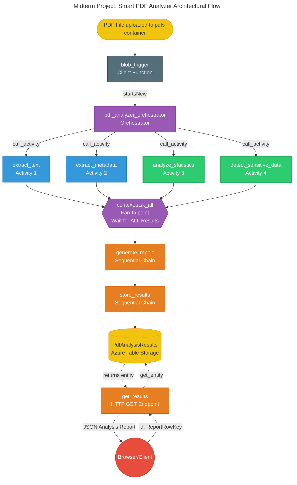

# CST8917 – Serverless Applications
# Midterm Project: Smart PDF Analyzer with Durable Functions

## Team Members and Contribution

| Member | Main Responsibilities |
|---|---|
| Jingjing Duan | Blob trigger, orchestrator, Fan-Out/Fan-In workflow, Azure deployment |
| Shan Jiang | Text extraction, metadata extraction, dependencies, HTTP test file |
| Ruaa Thamer | Statistics analysis, sensitive data detection, architecture diagram |
| Khalid Amchat | Report generation, Table Storage, HTTP retrieval API, README |

## Demo Video

YouTube demo video link:

https://youtu.be/79BR6Qtu7Io

## Project Overview

Smart PDF Analyzer is an Azure Durable Functions application that analyzes PDF files uploaded to Azure Blob Storage. When a PDF is uploaded to the `pdfs` container, a Blob Trigger starts a Durable Functions workflow that runs four analysis activities in parallel, generates a final JSON report, stores it in Azure Table Storage, and exposes HTTP endpoints to retrieve the results.

## Architecture



## Durable Functions Pattern

This project uses:

- **Blob Trigger** to detect PDF uploads.
- **Fan-Out/Fan-In** to run four analysis activities in parallel.
- **Chaining** to generate and store the final report after all activities finish.
- **HTTP Trigger** to retrieve stored reports.

## Features

The application extracts and analyzes:

- PDF text
- PDF metadata such as title, author, creator, and creation date
- Page count, word count, average words per page, and reading time
- Emails, phone numbers, URLs, and dates using regular expressions

## Local Setup

### 1. Clone the repository

```bash
git clone <REPOSITORY_URL>
cd MidProj_SmartPDFAnalyzer
```

### 2. Create and activate virtual environment

```bash
python -m venv .venv
source .venv/bin/activate
```

### 3. Install dependencies

```bash
pip install -r requirements.txt
```

### 4. Create `local.settings.json`

```json
{
  "IsEncrypted": false,
  "Values": {
    "AzureWebJobsStorage": "UseDevelopmentStorage=true",
    "PdfStorageConnection": "UseDevelopmentStorage=true",
    "FUNCTIONS_WORKER_RUNTIME": "python",
    "PDF_REPORT_TABLE_NAME": "Table storage name"
  }
}
```

Do not commit `local.settings.json`.

## Run Locally

### 1. Start Azurite

```bash
azurite
```

### 2. Start the Function App

```bash
func start
```

### 3. Upload a PDF

Using Azure Storage Explorer:

1. Connect to local Azurite.
2. Open Blob Containers.
3. Create a container named `pdfs`.
4. Upload a PDF file.

### 4. Check Table Storage

Open Azure Storage Explorer:

```text
Tables → PdfAnalysisReports
```

You should see stored report records.

## API Endpoints

| Method | Endpoint | Description |
|---|---|---|
| GET | `/api/reports` | Returns the latest 10 reports |
| GET | `/api/reports?limit=5` | Returns the latest 5 reports |
| GET | `/api/reports/{report_id}` | Returns one specific report |

## Local API Tests

```http
### Get latest 10 reports
GET http://localhost:7071/api/reports

### Get latest 5 reports
GET http://localhost:7071/api/reports?limit=5

### Get one report
GET http://localhost:7071/api/reports/<REPORT_ID>
```

## Azure Deployment

1. Create an Azure Function App.
2. Create or use an Azure Storage Account.
3. Add these Function App settings:

```text
AzureWebJobsStorage=<Azure Storage connection string>
PdfStorageConnection=<Azure Storage connection string>
FUNCTIONS_WORKER_RUNTIME=python
PDF_REPORT_TABLE_NAME=PdfAnalysisReports
```

4. Deploy from VS Code or Azure Functions Core Tools:

```bash
func azure functionapp publish <FUNCTION_APP_NAME>
```

5. In the Azure Storage Account, create a Blob container named:

```text
pdfs
```

6. Upload a PDF to the `pdfs` container.
7. Check Function App logs and Table Storage.

## Azure API Tests

```http
### Get latest 10 reports
GET https://<FUNCTION_APP_NAME>.azurewebsites.net/api/reports

### Get latest 5 reports
GET https://<FUNCTION_APP_NAME>.azurewebsites.net/api/reports?limit=5

### Get one report
GET https://<FUNCTION_APP_NAME>.azurewebsites.net/api/reports/<REPORT_ID>
```

## Table Storage Design

Reports are stored in the `PdfAnalysisReports` table.

| Field | Purpose |
|---|---|
| `PartitionKey` | Fixed value: `PDF_REPORT` |
| `RowKey` | Generated `report_id` |
| `file_name` | Original PDF file name |
| `blob_name` | Blob path |
| `processed_at_utc` | Processing timestamp |
| `status` | Processing status |
| `report_json` | Full JSON report |


## AI Disclosure

AI tools were used to support debugging, code review, and documentation drafting. The team reviewed, tested, and adjusted the generated content before submitting the final project.

